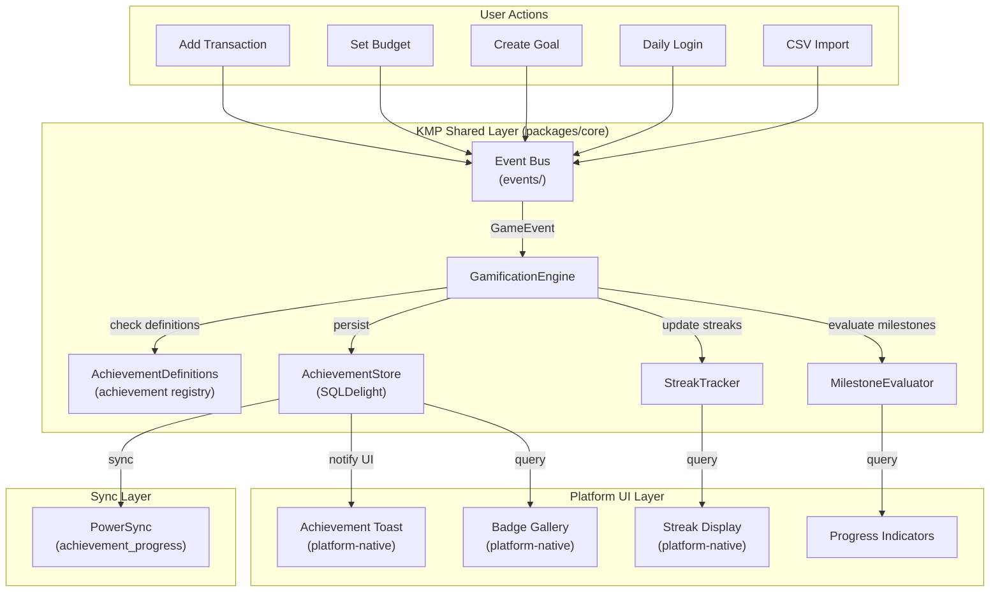
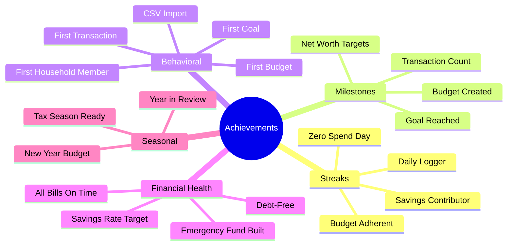
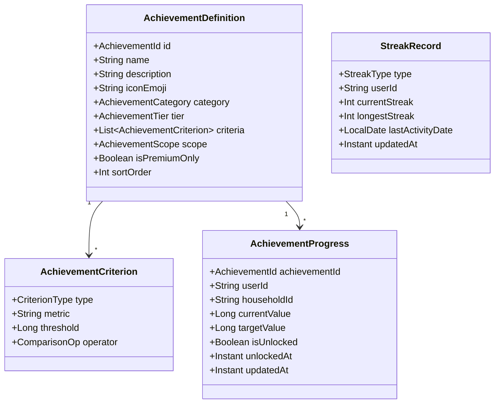
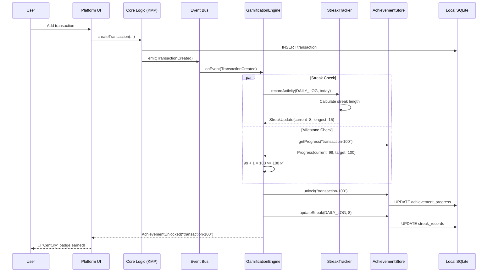
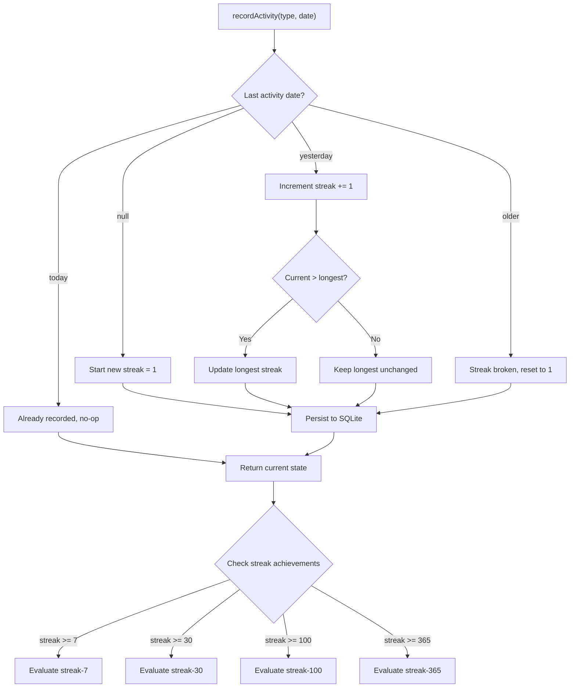
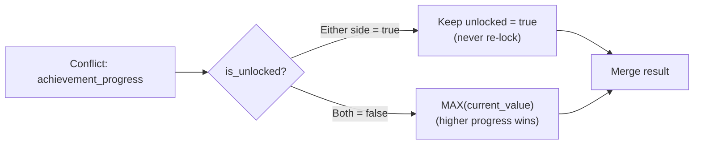
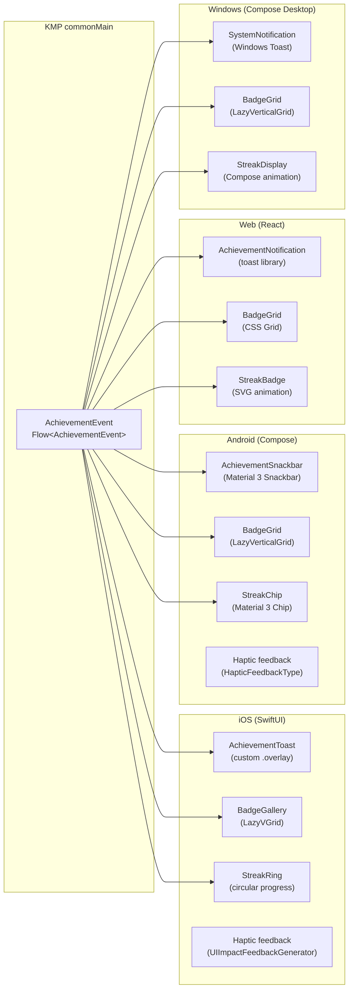
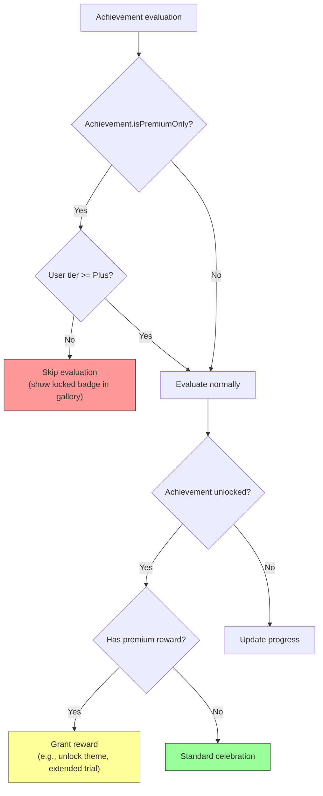
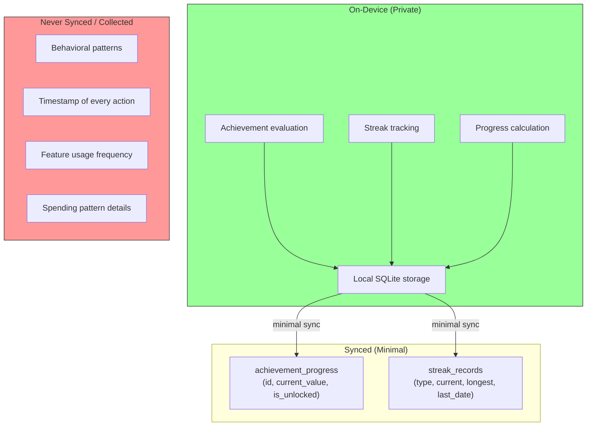

# ADR-0016: Gamification System Design

**Status:** Proposed
**Date:** 2025-04-21
**Author:** System Architect (AI agent)
**Reviewers:** Pending human review

## Context

Financial applications suffer from engagement decay — users enthusiastically track expenses for a few weeks, then gradually stop. Research shows that gamification elements (achievements, streaks, milestones) increase long-term engagement by 30–50% in habit-forming apps (Duolingo, Headspace, Strava).

Finance needs a gamification system that:

1. **Runs entirely on-device** (edge-first) — Achievement evaluation must not require server calls. Users should earn badges while offline.
2. **Respects privacy** — No behavioral tracking sent to servers. All achievement state is local-first, synced only for multi-device continuity.
3. **Integrates with KMP shared logic** — Achievement definitions and evaluation logic live in `packages/core/` (commonMain) so all four platforms share the same rules.
4. **Supports household context** — Some achievements are individual (streak tracking), while others are household-level (collective savings goals).
5. **Is premium-tier aware** — Some achievements unlock premium features as rewards; some achievements are premium-only to track.
6. **Uses existing event infrastructure** — The `packages/core/src/commonMain/kotlin/com/finance/core/events/` module provides the event bus for triggering achievement evaluation.

### Forces

- **Engagement vs. annoyance:** Gamification must feel rewarding, not patronizing. A finance app user is an adult managing real money, not a child playing a game.
- **Financial sensitivity:** Achievements should never encourage bad financial behavior (e.g., "Spend $1,000 in a day!" is harmful). All achievements should reinforce positive financial habits.
- **Offline-first:** A user who logs a transaction on an airplane should immediately see "🔥 7-day streak!" without waiting for sync.
- **Cross-platform consistency:** An achievement earned on iOS must appear on Android and Windows when the user switches devices.

## Decision

Implement a **local-first, event-driven gamification engine** in the KMP shared layer with platform-native celebration UIs.

### 1. System Architecture



### 2. Achievement Categories



### 3. Achievement Definition Model



**Core data types (KMP `commonMain`):**

```kotlin
// packages/core/gamification/AchievementDefinition.kt

enum class AchievementCategory {
    STREAK, MILESTONE, BEHAVIORAL, FINANCIAL_HEALTH, SEASONAL
}

enum class AchievementTier {
    BRONZE,   // Easy — encourage onboarding
    SILVER,   // Moderate — sustain engagement
    GOLD,     // Hard — reward dedication
    PLATINUM, // Expert — long-term mastery
}

enum class AchievementScope {
    INDIVIDUAL,  // Per-user (streaks, personal milestones)
    HOUSEHOLD,   // Shared (collective goals, household milestones)
}

enum class CriterionType {
    TRANSACTION_COUNT,       // Total transactions logged
    STREAK_LENGTH,           // Consecutive days of activity
    BUDGET_ADHERENCE_DAYS,   // Days within budget
    SAVINGS_GOAL_PERCENT,    // % of savings goal reached
    NET_WORTH_CENTS,         // Net worth milestone
    CATEGORY_COVERAGE,       // % of spending categorized
    ZERO_SPEND_DAYS,         // Days with no discretionary spending
    IMPORT_COUNT,            // Number of CSV imports
    HOUSEHOLD_MEMBER_COUNT,  // Members in household
}
```

### 4. Achievement Registry (Built-in Definitions)

| ID                   | Name               | Category         | Tier     | Criteria                                 | Scope      |
| -------------------- | ------------------ | ---------------- | -------- | ---------------------------------------- | ---------- |
| `first-transaction`  | First Step         | Behavioral       | Bronze   | 1 transaction logged                     | Individual |
| `transaction-100`    | Century            | Milestone        | Silver   | 100 transactions logged                  | Individual |
| `transaction-1000`   | Thousandaire       | Milestone        | Gold     | 1,000 transactions logged                | Individual |
| `streak-7`           | Week Warrior       | Streak           | Bronze   | 7-day logging streak                     | Individual |
| `streak-30`          | Monthly Master     | Streak           | Silver   | 30-day logging streak                    | Individual |
| `streak-100`         | Centurion          | Streak           | Gold     | 100-day logging streak                   | Individual |
| `streak-365`         | Year of Discipline | Streak           | Platinum | 365-day logging streak                   | Individual |
| `budget-first`       | Budget Beginner    | Behavioral       | Bronze   | 1 budget created                         | Individual |
| `budget-adherent-7`  | Budget Keeper      | Streak           | Silver   | 7 days within budget                     | Individual |
| `budget-adherent-30` | Budget Master      | Streak           | Gold     | 30 days within budget                    | Individual |
| `goal-first`         | Goal Setter        | Behavioral       | Bronze   | 1 savings goal created                   | Individual |
| `goal-reached`       | Goal Crusher       | Financial Health | Silver   | 1 savings goal at 100%                   | Individual |
| `emergency-fund`     | Safety Net         | Financial Health | Gold     | Emergency fund = 3× monthly expenses     | Individual |
| `zero-spend-day`     | No Spend Hero      | Financial Health | Bronze   | 1 zero-spend day                         | Individual |
| `zero-spend-week`    | Frugal Week        | Financial Health | Silver   | 7 zero-spend days (cumulative)           | Individual |
| `household-first`    | Team Player        | Behavioral       | Bronze   | Invite first household member            | Household  |
| `household-goal`     | Family Goal        | Financial Health | Gold     | Household savings goal reached           | Household  |
| `csv-import`         | Data Migrant       | Behavioral       | Bronze   | First CSV import                         | Individual |
| `all-categorized`    | Categorization Pro | Financial Health | Silver   | 100% transactions categorized this month | Individual |
| `year-in-review`     | Year in Review     | Seasonal         | Silver   | View annual summary in December/January  | Individual |

### 5. Event-Driven Evaluation



### 6. Streak Tracking Logic



**Streak types:**

| Streak Type           | Activity Definition                        | Reset Condition                          |
| --------------------- | ------------------------------------------ | ---------------------------------------- |
| `DAILY_LOG`           | Any transaction logged that day            | No transaction logged for a calendar day |
| `BUDGET_ADHERENT`     | All active budgets under limit for the day | Any budget exceeded                      |
| `SAVINGS_CONTRIBUTOR` | Any contribution to a savings goal         | No contribution for a calendar day       |
| `ZERO_SPEND`          | No expense transactions for the day        | Any expense transaction                  |

**Time zone handling:** Streaks use the user's local date (from device timezone), not UTC. The `StreakTracker` receives `LocalDate` from the platform layer, ensuring consistent evaluation regardless of timezone changes.

### 7. Data Model (SQLDelight)

```sql
-- Achievement progress (synced via PowerSync)
CREATE TABLE achievement_progress (
    id              TEXT PRIMARY KEY,
    achievement_id  TEXT NOT NULL,
    user_id         TEXT NOT NULL,
    household_id    TEXT,          -- NULL for individual achievements
    current_value   INTEGER NOT NULL DEFAULT 0,
    target_value    INTEGER NOT NULL,
    is_unlocked     INTEGER NOT NULL DEFAULT 0,  -- SQLite boolean
    unlocked_at     TEXT,          -- ISO 8601 timestamp
    created_at      TEXT NOT NULL,
    updated_at      TEXT NOT NULL,
    deleted_at      TEXT           -- soft delete
);

-- Streak records (synced via PowerSync)
CREATE TABLE streak_records (
    id                  TEXT PRIMARY KEY,
    streak_type         TEXT NOT NULL,
    user_id             TEXT NOT NULL,
    current_streak      INTEGER NOT NULL DEFAULT 0,
    longest_streak      INTEGER NOT NULL DEFAULT 0,
    last_activity_date  TEXT NOT NULL,  -- ISO 8601 date (LocalDate)
    created_at          TEXT NOT NULL,
    updated_at          TEXT NOT NULL,
    deleted_at          TEXT
);

-- Indexes for common queries
CREATE INDEX idx_achievement_user ON achievement_progress(user_id, is_unlocked);
CREATE INDEX idx_achievement_household ON achievement_progress(household_id) WHERE household_id IS NOT NULL;
CREATE INDEX idx_streak_user ON streak_records(user_id, streak_type);
```

### 8. Sync Integration

Achievement and streak data syncs via PowerSync. Since achievements are primarily individual, they sync through the `user_profile` bucket with household achievements in the `by_household` bucket:

```yaml
# PowerSync sync-rules.yaml additions

user_profile:
  data:
    # Individual achievement progress
    - >
      SELECT id, achievement_id, user_id, household_id,
             current_value, target_value, is_unlocked, unlocked_at,
             created_at, updated_at, deleted_at
      FROM achievement_progress
      WHERE user_id = bucket.user_id
        AND (household_id IS NULL)
        AND deleted_at IS NULL

    # Streak records
    - >
      SELECT id, streak_type, user_id, current_streak,
             longest_streak, last_activity_date,
             created_at, updated_at, deleted_at
      FROM streak_records
      WHERE user_id = bucket.user_id AND deleted_at IS NULL

by_household:
  data:
    # Household-scoped achievements
    - >
      SELECT id, achievement_id, user_id, household_id,
             current_value, target_value, is_unlocked, unlocked_at,
             created_at, updated_at, deleted_at
      FROM achievement_progress
      WHERE household_id = bucket.household_id AND deleted_at IS NULL
```

**Conflict resolution:** Achievement progress uses **MAX-WINS** strategy (a custom conflict resolver): if both devices claim progress, keep the higher value. An achievement once unlocked is never re-locked.



### 9. Platform UI Integration

The KMP shared layer emits `AchievementEvent` objects. Platform UIs subscribe and render celebrations natively:



**Platform-specific celebration patterns:**

| Platform | Achievement Toast                            | Haptic                           | Sound                          | Duration |
| -------- | -------------------------------------------- | -------------------------------- | ------------------------------ | -------- |
| iOS      | Custom SwiftUI overlay with spring animation | `.success` impact                | System positive sound          | 3s       |
| Android  | Material 3 Snackbar with confetti animation  | `HapticFeedbackType.LongPress`   | System notification            | 3s       |
| Web      | Toast notification with CSS animation        | Navigator.vibrate (if available) | None (respect silent browsing) | 4s       |
| Windows  | System toast notification                    | None                             | System notification            | 3s       |

### 10. Premium Integration

Some achievements interact with the premium tier system (ADR-0015):



**Premium-only achievements:**

| Achievement           | Tier Required | Rationale                          |
| --------------------- | ------------- | ---------------------------------- |
| All ML-categorized    | Plus          | Requires AI categorization feature |
| Bank sync streak      | Pro           | Requires bank connections feature  |
| Multi-currency master | Plus          | Requires multi-currency feature    |
| Predictive budget hit | Pro           | Requires predictive budgeting      |

**Achievement rewards (engagement incentives):**

| Reward         | Triggered By          | Effect                     |
| -------------- | --------------------- | -------------------------- |
| Extended trial | First 30-day streak   | 7 extra days of Plus trial |
| Custom theme   | Gold-tier achievement | Unlock a special app theme |
| Badge flair    | Platinum achievement  | Special profile badge      |

### 11. Privacy Considerations



**Privacy rules:**

1. Achievement evaluation happens **entirely on-device**. The server never runs achievement logic.
2. Only achievement progress (current value, unlock state) syncs — never the behavioral data that earned it.
3. No analytics events are emitted for achievement unlocks (no "user earned badge X" tracking).
4. Streak data contains only the count and last activity date — not what transactions triggered it.
5. Users can disable gamification entirely in settings (feature flag: `gamification.enabled`).

### 12. Performance Considerations

Achievement evaluation runs after every relevant user action. It must be fast:

| Operation                       | Budget | Strategy                                                     |
| ------------------------------- | ------ | ------------------------------------------------------------ |
| Single achievement check        | < 1ms  | In-memory definition lookup; single DB read for progress     |
| Full re-evaluation (app launch) | < 50ms | Batch query all progress; evaluate in parallel               |
| Streak update                   | < 2ms  | Single row upsert; no complex queries                        |
| UI notification                 | < 16ms | Platform-native rendering; no achievement logic on UI thread |

**Optimization:**

- Achievement definitions are compiled into an in-memory registry at app start (not queried from DB each time).
- Progress is cached in memory; DB writes are batched (write-behind cache).
- Evaluation is triggered by specific event types, not on every action (e.g., `TransactionCreated` triggers transaction milestones, not budget achievements).

## Alternatives Considered

### Alternative 1: Server-Side Gamification

- **Pros:** Single source of truth; prevents manipulation; supports global leaderboards.
- **Cons:** Violates edge-first principle; breaks offline; adds server load; every action requires network call; privacy-invasive (server tracks all behavior).

### Alternative 2: Third-Party Gamification SDK (e.g., Gametize, BadgeOS)

- **Pros:** Pre-built UI components; analytics dashboard; proven engagement patterns.
- **Cons:** External dependency; data leaves device (privacy violation); no KMP support; vendor lock-in; cost; doesn't integrate with existing event bus.

### Alternative 3: Simple Points System Only

- **Pros:** Very simple to implement; single metric to track.
- **Cons:** Points without context are meaningless; doesn't encourage specific behaviors; no visual appeal; doesn't leverage streak psychology (loss aversion).

### Alternative 4: No Gamification

- **Pros:** Zero complexity; no maintenance burden.
- **Cons:** Loses proven engagement tool; competitors (Mint, YNAB, Copilot) use gamification elements; higher churn risk.

## Consequences

### Positive

- **Engagement boost:** Streak mechanics leverage loss aversion (the most powerful behavioral motivator) to keep users logging transactions daily.
- **Edge-first:** All evaluation is local — achievements work offline, instantly, with no server dependency.
- **Privacy-preserving:** Only minimal progress data syncs; behavioral patterns never leave the device.
- **Platform-native celebrations:** Each platform uses its best celebration patterns (haptics, native animations, system notifications).
- **Extensible:** New achievements are added by defining a new `AchievementDefinition` in the registry — no code changes to the engine.
- **Premium driver:** Premium-only achievements and achievement rewards create natural upgrade motivation.

### Negative

- **Code complexity:** Event bus → gamification engine → achievement store → platform UI is a multi-layer pipeline.
- **Sync edge cases:** Cross-device streak reconciliation (user logs on phone, then desktop) needs careful MAX-WINS conflict resolution.
- **Content design effort:** Each achievement needs copy, icon, category, and tier — ongoing design work.
- **Potential for patronizing UX:** Must test with real users to ensure badges feel rewarding, not condescending.

### Risks

| Risk                                        | Likelihood | Impact | Mitigation                                                                                |
| ------------------------------------------- | ---------- | ------ | ----------------------------------------------------------------------------------------- |
| Streak manipulation (clock change)          | Medium     | Low    | Use last-synced server time as sanity check; accept local date for offline                |
| Achievement fatigue                         | Medium     | Medium | Rate-limit celebrations (max 2 per session); progressive difficulty                       |
| Cross-device streak sync conflict           | Low        | Medium | MAX-WINS resolver; streak can only increase, never decrease via sync                      |
| Performance impact of per-action evaluation | Low        | Medium | Event-type filtering; in-memory caches; < 1ms per evaluation                              |
| Encouraging unhealthy financial behavior    | Low        | High   | All achievements reviewed for positive behavior alignment; no spending-based achievements |

## Implementation Notes

### New Package Structure

```
packages/core/src/commonMain/kotlin/com/finance/core/gamification/
├── AchievementDefinition.kt     // Data types and enums
├── AchievementRegistry.kt       // Built-in achievement definitions
├── GamificationEngine.kt        // Event listener + evaluator
├── StreakTracker.kt              // Streak calculation logic
├── MilestoneEvaluator.kt        // Threshold-based evaluation
├── AchievementStore.kt          // Persistence interface (expect)
└── AchievementEvent.kt          // UI notification events
```

### Integration Points

| Existing Module       | Integration                                           | Direction             |
| --------------------- | ----------------------------------------------------- | --------------------- |
| `events/` (Event Bus) | GamificationEngine subscribes to GameEvents           | Events → Engine       |
| `featureflags/`       | `gamification.enabled` flag; premium-only checks      | Engine → Flags        |
| `analytics/`          | Achievement progress as KPI metric source             | Engine → Analytics    |
| `subscription/`       | Premium tier check for premium-only achievements      | Engine → Subscription |
| `sync/`               | achievement_progress and streak_records tables synced | Engine → Sync         |
| `household/`          | Household-scoped achievement evaluation               | Engine → Household    |

### Feature Flag

```kotlin
// Addition to FeatureFlags.kt
val GAMIFICATION_ENABLED = FeatureFlagKey("gamification.enabled")
val GAMIFICATION_CELEBRATIONS = FeatureFlagKey("gamification.celebrations.enabled")
```

## References

- [ADR-0001: Cross-Platform Framework](../0001-cross-platform-framework.md) — KMP shared logic architecture
- [ADR-0002: Backend & Sync Architecture](../0002-backend-sync-architecture.md) — PowerSync sync rules
- [ADR-0004: Auth & Security Architecture](../0004-auth-security-architecture.md) — Household RBAC
- [ADR-0015: Premium Architecture](./adr-0015-premium-architecture.md) — Premium tier integration
- [Duolingo Engineering: Streak Mechanics](https://blog.duolingo.com/) — Streak design patterns
- [Nir Eyal: Hooked](https://www.nirandfar.com/hooked/) — Behavioral design framework
- `packages/core/src/commonMain/kotlin/com/finance/core/events/`
- `packages/core/src/commonMain/kotlin/com/finance/core/analytics/`
